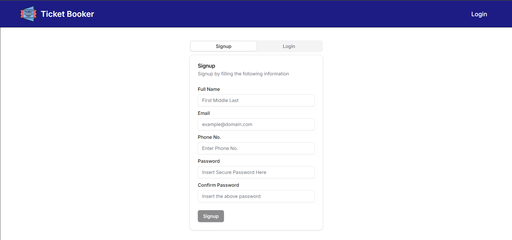

# Theatre Booking System

### By Tirthraj Mahajan

The Theatre Booking System is a project developed as part of a DBMS course, utilizing a microservice architecture to handle various aspects of the system. This application allows users to book movie tickets while providing comprehensive management tools for theatre administrators. It is built with a focus on modularity, and future data analysis.

## Overview

The Theatre Booking System is designed to streamline the movie booking process while offering powerful tools for managing theatre screens, showtimes, pricing, and customer data. Built on RESTful architecture, each API is mapped to one or more database queries, ensuring efficient data handling.

## Tech Stack
- **Frontend**: Next.js with ShadCN
- **Backend**: Node.js with Express.js for each microservice
- **Database**: MySQL

## Features

1. **Customer Service**: Manages customer data and credentials, including logs of actions.
2. **Movie Service**: Handles movie details, genres, and associated images.
3. **Theatre Service**: Provides admin tools to manage theatres, screens, seat layouts, and showtimes.
4. **Booking Service**: Manages bookings, pricing, and logs booking history.
5. **Admin Panels**: Theatre admins can:
   - Customize seating arrangements by defining screen layouts.
   - Set dynamic pricing based on seat types and showtimes.
6. **Seat Type Customization**: Define seat types such as Standard, Recliner, Premium, and VIP.
7. **Dynamic Pricing**: Showtimes and seat types influence pricing.

## Database Design

The database schema is designed with a balance between normalization and denormalization, ensuring efficient querying without sacrificing integrity. Here are some highlights:

- **Normalization**: Tables such as `movies`, `theatres`, and `customers` are highly normalized to avoid redundancy.
- **Denormalization**: Some tables, like `booking_seats`, include redundant data to optimize query performance.
  
### Schema Overview
The database consists of tables such as:
- `customers`: Manages customer details.
- `movies`, `movie_genres`: Stores movie information and genre mapping.
- `screens`, `seats`, `seat_types`: Manages theatre screens, seat types, and layouts.
- `showtimes`, `pricings`: Manages showtime schedules and seat-based pricing.
- `bookings`: Logs customer bookings with relevant pricing details.

## Microservice Architecture

The project is divided into four microservices, each responsible for a specific function:

1. **Customer Service**: Handles customer data, credentials, and logging of actions.
2. **Movie Service**: Manages all movie-related information, including genres and images.
3. **Theatre Service**: Administers theatre, screens, seat types, and showtime schedules.
4. **Booking Service**: Manages bookings, seat assignments, and pricing logs.

Each service has its own database user with specific privileges, utilizing MySQL's Data Control Language (DCL) to implement least-privilege access control.

Here’s a more detailed section on the **RESTful architecture** for your Theatre Booking System, which you can include in the **README.md** file:

---

## RESTful Architecture

The Theatre Booking System is built on a well-structured RESTful API architecture for all its services, ensuring modularity, scalability, and ease of integration. Each service follows the REST principles, with distinct endpoints for managing resources, and each endpoint maps to specific HTTP methods and database operations.

### RESTful API Principles
Each API service follows the standard REST principles:
1. **Statelessness**: Each API request is independent, meaning the server does not store any session data between requests. This ensures scalability and simplicity in handling requests.
2. **Separation of Concerns**: Every service in the system has a distinct responsibility and exposes only the necessary endpoints, allowing for loose coupling between services.
3. **Resource-Oriented**: Every API endpoint is mapped to a specific resource (e.g., movies, theatres, bookings) and uses meaningful URIs to perform CRUD (Create, Read, Update, Delete) operations.
4. **HTTP Verbs**: Each HTTP method has a specific role in interacting with the resources:
   - **GET**: Retrieve resources (e.g., getting the list of movies, showtimes).
   - **POST**: Create new resources (e.g., creating a new customer, booking tickets).
   - **PUT**/**PATCH**: Update existing resources (e.g., updating customer details, modifying a booking).
   - **DELETE**: Remove resources (e.g., cancel a booking, remove a showtime).

### API-to-Database Translation
Each RESTful API call translates into one or more SQL queries, with careful mapping to ensure performance and accuracy:
- **GET Requests**: Typically translate into `SELECT` queries with appropriate filters.
- **POST Requests**: Correspond to `INSERT` queries, where relationships between tables (e.g., `movie_genre_mapping`, `booking_seats`) are carefully handled.
- **PUT/PATCH Requests**: Translate to `UPDATE` statements, modifying specific fields in the database.
- **DELETE Requests**: Map to `DELETE` queries, sometimes with cascading effects (e.g., when a booking is deleted, associated seats are also removed).

### Consistency and Transactions
For critical operations such as bookings, where multiple tables (e.g., `bookings`, `booking_seats`, `pricings`) are involved, database transactions ensure consistency. If any operation fails (e.g., a seat is no longer available), the transaction is rolled back to maintain data integrity.

### Error Handling
Each API is designed to handle errors gracefully:
- **400 Bad Request**: Returned when the client sends an invalid or incomplete request.
- **404 Not Found**: Returned when the requested resource is not found in the database.
- **500 Internal Server Error**: Used for unexpected server-side failures, with error logging in place for debugging.

### Security and Validation
Each service validates input to prevent SQL injection and unauthorized access:
- **Input Validation**: Ensure that only valid data (e.g., correct email format, non-negative values for pricing) is accepted.
- **Role-based Access Control (RBAC)**: For example, only theatre admins can create screens or showtimes.

---

## Triggers and Logs

The database employs triggers to automate actions and maintain data consistency. For example:

```sql
DELIMITER //
CREATE TRIGGER log_customer_booking
AFTER INSERT ON bookings
FOR EACH ROW
BEGIN
    DECLARE customerFullName VARCHAR(100);
    DECLARE customerEmail VARCHAR(255);

    SELECT customer_full_name, customer_email INTO customerFullName, customerEmail
    FROM customers WHERE customer_id = NEW.customer_id;

    INSERT INTO customer_logs (customer_id, customer_full_name, customer_email, customer_action)
    VALUES (NEW.customer_id, customerFullName, customerEmail, "BOOKED MOVIE");
END //
DELIMITER ;
```

These triggers help maintain logs and ensure actions such as customer creation, booking, or deletion are recorded automatically.

## Data Control and Access Management

Each microservice has its own database user to limit access:

```sql
CREATE USER 'movies-service'@'%' IDENTIFIED BY 'movies-service';
CREATE USER 'theatre-service'@'%' IDENTIFIED BY 'theatre-service';
CREATE USER 'customer-service'@'%' IDENTIFIED BY 'customer-service';
CREATE USER 'booking-service'@'%' IDENTIFIED BY 'booking-service';
```

This ensures that each service has access only to the data it needs, improving security and reducing the risk of unauthorized access.

## Future Scope

- **Data Analytics**: The system is designed to enable future integration of data analytics for insights into customer preferences, seat occupancy rates, and dynamic pricing trends.
- **Scalability**: With its microservice architecture, the system can easily scale as the number of users, movies, or theatres increases.
- **Enhanced Customization**: In the future, we plan to implement more features for theatre admins, such as dynamic seat mapping based on real-time availability and enhanced reporting tools.

## Photos


### Theatre Home Page
This is what the theatre admin will see when they login on `/theatre/login`


### Theatre Add Screen Page
The theatre admin can add a new screen where they can select the seating arrangement by left clicking the seats and also the type of seats by right clicking on the seats


### Theatre Show Screen Page
After adding the screens, the theatre user can see the final layout the screen


### Theatre Show Time Page
The theatre admin can check the showtimes of their particular theatre for all the screens


### Theatre Add Show Page
The theatre admin can insert a new show and insert the input data.
Note: The theatre admin only has to enter the start timing of the show. The end timing will automatically be inserted depending on the length of the movie
  
The system allows theatre admin to change the pricing of tickets depending on the movie, the showtimes and the seat types


### User Signup and Login Page
This is what the user will see when they want to signup or login by going to `/user/home` page



### User Home Page
After authentication, the user will see the homepage which contains the list of movies sorted by their genre


### Search Options
The systems allows the user to search via `Movies` or `Theatres`


### Movie Info Page
The user can check the movie details


### Theatre Info Page
The user can also check the theatre showtime details


### Bookings Page
When the user clicks on the bookings page:
The user will be able to  
- see the theatre, screen, showtime and movie details
- see the already booked seats
- check the type and pricing of the seats 
- select multiple seats at once and book them


Here's a README file for users who want to manually run the services using the `start.bat` file:

---

# Manual Start Guide for Theatre Booking System

This project uses a microservice architecture with separate services for movies, customers, theatres, and bookings. If you prefer to start the services manually, follow the instructions below.

## Prerequisites

Before running the services, make sure you have the following installed:

1. **Node.js** (v14 or higher)
2. **npm** (Node Package Manager)
3. **MySQL** (For the database setup)
4. **Git** (Optional, but recommended for version control)

Make sure you have each service properly set up with its environment variables configured.

## Project Structure

```
- backend/
   - movies-service/
   - customer-service/
   - theatre-service/
   - booking-service/
- frontend/
- start-app.bat
```

Each microservice is located inside the `backend/` folder, and the frontend is located in the `frontend/` folder. The `start.bat` file automates starting all the services, but the following steps show how to do this manually.

## Running the Services Manually

To start the services manually, follow these steps:

### 1. Clone the Repository
If you haven't already, clone the project repository to your local machine:
```bash
git clone <repository_url>
cd <project_folder>
```

### 2. Start the Backend Services

Each service needs to be started in its respective directory. Open multiple terminal windows for each service, or use the `start.bat` file for automation.

#### Movie Service
Navigate to the `movies-service` folder and run the following commands:
```bash
cd backend/movies-service
npm install
npm run dev
```

#### Customer Service
Navigate to the `customer-service` folder:
```bash
cd backend/customer-service
npm install
npm run dev
```

#### Theatre Service
Navigate to the `theatre-service` folder:
```bash
cd backend/theatre-service
npm install
npm run dev
```

#### Booking Service
Navigate to the `booking-service` folder:
```bash
cd backend/booking-service
npm install
npm run dev
```

### 3. Start the Frontend Application

After starting the backend services, open a new terminal window and navigate to the `frontend` folder:
```bash
cd frontend
npm install
npm run dev
```

### 4. Access the Application

Once all the services are running, the frontend application will be available at:
```
http://localhost:3000
```

You can access the various functionality of the Theatre Booking System from this URL.

## Using the `start-app.bat` Script

To automatically start all services in separate terminal windows, simply run the `start-app.bat` file:

1. Double-click the `start-app.bat` file from the project root.
2. It will start all four backend services and the frontend in separate command windows.

If you prefer, you can also run the following command in the terminal:
```bash
start start-app.bat
```

## Stopping the Services

To stop the services, simply close each terminal window where the services are running.

---

By following this guide, you'll be able to manually run and manage each service within the Theatre Booking System. The `start-app.bat` script can be used to automate the startup process, but if you're troubleshooting or just prefer manual control, this guide should help you navigate the process efficiently.